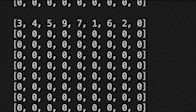

# Sudoku GUI - Python Tkinter

A graphical user interface for playing sudoku on three difficulties. Game uses *Python's Tkinter* module which works best with **Windows** users.

### Gameplay

Click the numbers below to highlight them and them click on the grid to fill the space. Number check returns the amount of wrong numbers and highlights them in red. You can start a new game with different difficulty any time.

### Sudoku template generator

Sudoku template generator uses a backtracking algorithm for completing the grid. Template is 9 python lists within a list. Algorithm starts from *row 1* and completes the full *row* before moving on to the next. When there are no legitimate numbers to add according to sudoku rules backtracking checks the remaining numbers of your current *square* / *column* and removes them from the current *row* --> algorithm starts again from the first empty coordinate on the grid. If the *row* gets stuck on a loop for 10 cycles, algorithm resets the entire *row*. If stuck for 20 cycles, it resets the current and previous *rows*.

### Algorithm visualization
To visually see the algorithm at work, remove the commentation on lines 57-60 and 84-87. Algorithm visualization on your command prompt should look as such:

